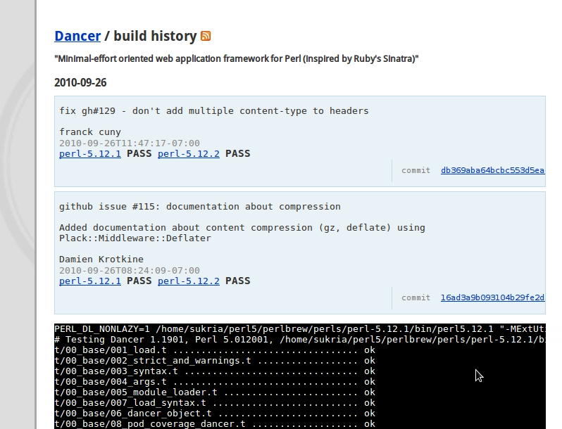

> If you'd like to be a jitter bug, First thing you must do is get a jug, Put whiskey, wine and gin within, And shake it all up and then begin.

Earlier this month sukria set up a [shell script](http://github.com/sukria/capsule) to run the Dancer's tests suit. The script is simple, but does what we want:

-   every 15 minutes, it pulls from the github repository
-   for every perl installed via perlbrew, it executes the tests suite
-   it stores the results in text file
-   finally, it creates a code coverage report for the master branch

The only problem I had with this is that it wasn't really easy to find the appropriate test report you might want to check.

That's when I decided to write an interface to this: [jitterbug](https://github.com/franckcuny/jitterbug).

## Demo

[You can check Dancer's version](http://jitterbug.perldancer.org/). The interface is really simple: there's a list of repositories, the status of the last build, and a link to a list of all the project's builds.

## How it works

For each project you want to use with jitterbug, you set the url of the HTTP hook in the administration page of your project. Each time a push is detected, GH will send you a notification (you can see details of the content). If the project doesn't already exist in your setup, it will be created, so you don't need to maintain or update a configuration file each time you create a new repository. The notification creates a task in a queue, and a script pulls the task and executes it.

> If you don't want anyone to use your setup for building their modules, you can protect the **/hook/** path with a .htaccess, and use the following kind of url : <http://user:pass@>.../

The script (`builder.pl`, provided with JB) will clone the repository, switch to the given commit and run the tests. It works both with classic distribution having a Makefile.PL and Dist::Zilla setups. The output is stored on the disk and some information about the project will be updated. [You can see the result for Dancer](http://jitterbug.perldancer.org/project/Dancer).

This script relies on two important things: [perlbrew](http://github.com/gugod/App-perlbrew) and [cpanminus](http://github.com/miyagawa/cpanminus). So your tests will be executed against every Perl version you have installed and thanks to cpanminus, all the deps will be installed too.

If the test fails, a mail is sent to the author.

## What's next

A list of some features I want to have:

-   IRC notifications (something like: \[author's name\]: link to the commit - commit message - link to the build)
-   customizable builder script (so you can add your own hook to building a package, having private notifications, etc.)
-   simple administration (restart a build, etc.)

(thanks to [sawyer](http://github.com/xsawyerx) and [sukria](http://github.com/sukria/)).
