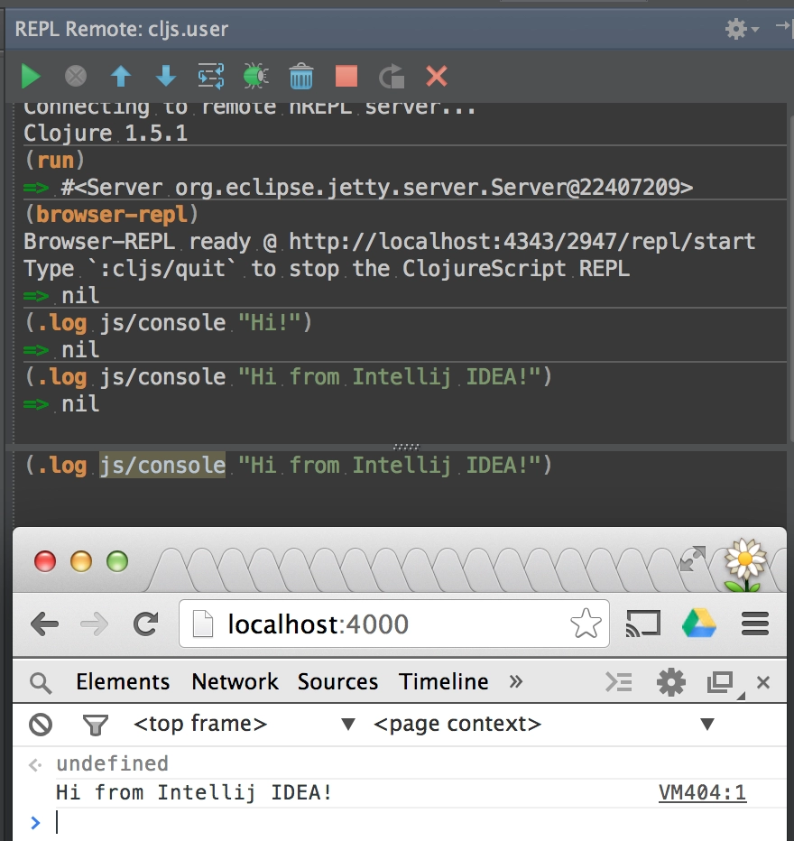

> This notes are mostly for me to remember how to get an environment up and running.

I've tried to play with [Clojurescript](https://github.com/clojure/clojurescript) a few times already, but I never managed to get an environment working as I wanted. Granted, I didn't try very hard, and my requirements are probably not commons, so I'm not blaming the tools.

This time I've decided to dedicate a little bit more times and try to see how far I could go. My requirements are:

-   it needs to work in a linux VM
-   I want to have a nREPL connection

    -   so I can execute code from the REPL and execute them in the browser
    -   I also want to be able to call functions from the browser REPL
-   It needs to work within Emacs and/or Intellij IDEA

The Intellij IDEA requirement is new. I've never used an IDE before and I've decided to give it a try. I've installed the [Cursive](http://cursiveclojure.com) plugin for Intellij and so far I'm happy with it.

I'm pleased to say that after a few hours I had a completely working environment meeting all my requirements. I'm pretty sure this notes will become outdated quickly, so I'll try update this post as I discover more things.

## The VM

I like Vagrant and there's no reason to not use it for this kind of projects. I've created a [repository](https://github.com/franckcuny/devbox) on GitHub with my setup for that. It's a simple VM with VirtualBox and Vagrant. I'm using Ansible to do the provisioning part.

After cloning the repository, you can run `vagrant up` and a virtual machine, running Ubuntu 13.10, will be started and provisionned (a bunch of tools like tmux are installed, but what really interest us here is the openjdk). Once it's up, a I run `vagrant ssh` then I start a `tmux` session.

## Create a project

I create a project using the [cljs-start](https://github.com/magomimmo/cljs-start) template for leiningen. To be honest, all the hard work is done by this template, I'm just putting the pieces together to have the setup I want build around it. With this template, you get:

-   the ability to start a HTTP server for serving your static files
-   a browser-repl from nREPL

This plugin relies on [Austin](https://github.com/cemerick/austin).

All I needed to do was to run `lein new cljs-start project` (where project is the name of my project).

## The REPL

Once you've started to work with a REPL it's hard to go back to a language that don't have one. When working with Clojure, you get used very quickly to it, especially since nREPL is so nice, and allows you to work on a remote box.

The only tricky thing when setting up the VM is to be sure to forward a few ports for:

-   nREPL - so you can connect from the host to the REPL running on the guest
-   the browser REPL - so your REPL can talk to the browser

I run the REPL in headless mode on the VM (in my `tmux` session), from my project's directory:

``` bash
# specify a port that I will be forwarded from my host to the guest
AUSTIN_DEFAULT_SERVER_PORT=4343 lein repl :headless :host 0.0.0.0 :port 4242
```

The `AUSTIN_DEFAULT_SERVER_PORT` variable is the port that will be used by your REPL to talk to the browser. That's why you need to forward this port in Vagrant. The other options (**host** and **port**) are here to tell the repl to listen on all the interfaces (so I can connect from the host) on the given port.

## Editor

> I'm focusing on Intellij IDEA here, but it works the same with Emacs/[CIDER](https://github.com/clojure-emacs/cider).

To install the Cursive plugin, you need to go to [this page](http://cursiveclojure.com/userguide/index.html) and follow the instructions.

I can now open a project in Intellij and start coding. I've configured my project to use a remote REPL.

 Now I can connect to the remote REPL and do a quick test to see if it works:

 

Great! It's time to start the web server to serve our static files and see if I can connect the browser-repl to it too. Running the following code in the REPL should do the trick:

``` clojure
(run)          ;; will start a server with jetty on port 3000, that I can reach from port 4000
(browser-repl) ;; that’s the *really* cool part
```

If I want to test something, all I have to do is to load the file into the REPL and then call a function. For example:

``` clojure
(.log js/console "Hi from Intellij IDEA!")
```

and see the output in my browser's console!



When working on the project, I can run evaluate the file or a form and send it to the browser. Again, this would be the same with Emacs, instead of having CIDER to use a local nREPL session, you'll just connect to a remote one.

## Conclusion

I realize that it's not the easiest setup. I'm maintaining the build system we have at work for our sites; we use javascript and nodejs, and I'm really upset by the complexity of our process. If I had to put with all of that to build a site I would be pretty mad. Still, I think this setup can be simplified a lot. But using a VM also makes it easier to give a working environment to a new developer, and it's easy to throw it away, after all, I'm using it mostly to run the REPL and to have it working in an environment similar to what it would be in production.

I have to admit that so far, I enjoy Cursive, it's stable and it works well. I'm still learning how to use the IDE, but some features are usefull (creating the functions, checking the number of parameters, displaying docstring, etc). We will see how long I stick to it.
